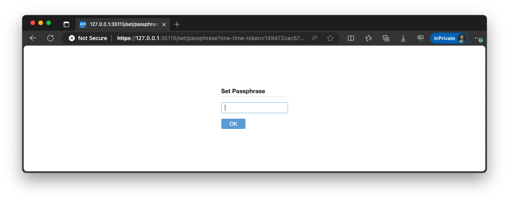

# Using Intel VTune, the modern x86 profiler

This page describes VTune setup relevant to our experiments. It contains pointers to various information. 

## Why VTune

For performance debugging like this, our "roll-it-your-own" manual code instrumentation can be too rudimentary. Modern profilers have been crucial. In short, programmer launches a tool ("profiler") which in turns launches the target program to be profiled. The profiler collects key information about target program execution, and presents the results to developers for post-analysis.

Over the past decade, profiling has seen tremendous improvement, evolving from software-based instrumentation to hardware-assisted sampling. Today, profilers can have very low overhead. 

## Naming

**VTune** is Intel's profiler. Prior to 2018 it was called Intel "VTune Amplifier" (a marketing term). There are still some old documents online with the latter name. Many of the current VTune executables are still named with the "amplxe-" prefix. Today it is called "oneAPI VTune". 

## VTune documents

VTune's [front page](https://software.intel.com/content/www/us/en/develop/tools/vtune-profiler/get-started.html) feature short articles & videos. Recommended readings: 

* A quick introduction. This [video](https://software.intel.com/content/www/us/en/develop/videos/introduction-to-intel-vtune-amplifier.html) (7 min)
* A case study on profiling Linux program. This [video](https://software.intel.com/content/www/us/en/develop/videos/finding-application-hotspots-on-a-linux-system-with-intel-vtune-amplifier-xe.html) (4.5min)
* About CPU instruction pipeline: this [video](https://techdecoded.intel.io/quickhits/what-you-need-to-know-about-the-instruction-pipeline/?elq_cid=3074796&erpm_id=5831526#gs.9eq2sk) and [this article](https://techdecoded.intel.io/resources/understanding-the-instruction-pipeline/?-1882156948.1541449095&erpm_id=3147218&elq_cid=3074796&erpm_id=5831526#gs.9ee57j) . A good refresher on CPU architecture and for understanding architecture profiling results. 

There are more and you may skim them.

The official user guide is [here](https://software.intel.com/content/www/us/en/develop/documentation/vtune-help/top.html). It's long and you do NOT have to read from back to end. Just make sure when you Google/Bing (e.g. "vtune threading profiling"), ONLY pick results coming from this user guide. 

## Step 0. Setup
In our experiments, we run and profile our program on the **server machine** and view profile results on your **local machine** (Windows/Linux/Mac) from a browser.

First, add VTune to the executable path: 

```
source /opt/intel/vtune_profiler/vtune-vars.sh
export INTEL_LIBITTNOTIFY64=/opt/intel/vtune_profiler/lib64/runtime/libittnotify_collector.so
```

Do this every time you login to the server. Or you can simply do "source env-vtune.sh" (a script provided to you). 

Verify that vtune can be found: 

```
$ which vtune
/opt/intel/vtune_profiler_2020.2.0.610396/bin64/vtune
$ which vtune-backend
/opt/intel/vtune_profiler_2020.2.0.610396/bin64/vtune-backend
```

[Reference](# https://software.intel.com/content/www/us/en/develop/documentation/vtune-help/top/api-support/instrumentation-and-tracing-technology-apis/basic-usage-and-configuration/configuring-your-build-system.html#configuring-your-build-system) 

## Step 1. Trace collection

Develop code on the server remotely (e.g. via VS code). Write code -> build binary -> (test to make sure it works correctly). 

Next, profile the program with VTune. To do so, from the server command line: 

### Example commands, to execute for each collection

```
# hotspot analysis
vtune -collect hotspot -knob sampling-mode=hw ./myprogram

# threading analysis
vtune -collect threading -knob sampling-and-waits=hw ./myprogram

# microarchitecture analysis
vtune -collect uarch-exploration ./myprogram

# sample command to profile the assignment program
vtune -collect hotspot -knob sampling-mode=hw ./list-p --iterations=100M --threads=1 --parts=1
```

(``-collect hotspot`` seems the same as ``-collect hotspots``)

### Where are the profiling results?

They are stored in a subdirectory automatically named as, e.g. "r000tr/", "r014ue/", "r027hs/". 

The numbers are assigned by VTune in an ascending manner. The last two letters are the analysis type. tr-"threading", ue-"microarchitecture exploration", "hs"-hotspot. 

## Step 2. Launch vtune-backend (webserver)

We will launch "vtune-backend'' on the server, which will present the profiling results over web UI: 

```bash
# Use a random port (recommended)
vtune-backend --data-directory <your directory> 

# Use a specific port, run "source env-tune.sh" before below 
vtune-backend --web-port ${MYPORT} --data-directory <your directory>
```

For **\<your directory\>**, you need to put the parent location where your results are located. For instance, if your results are located in `/u/bfr4xr/p2-concurrency/exp2/r000hs`, then **\<your directory\>** should be `--data-directory /u/bfr4xr/p2-concurrency/exp2`.
If you successfully launch vtune-backend, you will see similar lines like below:


In this case, the port number is `38881`. 

## Step 3. View trace from a local browser

Make **another** SSH connection (from your local machine to the server) with the port from the output above, e.g. 

```bash
# From your local machine (Windows: PowerShell/VSCode; Mac: Terminal)
ssh -L 38881:127.0.0.1:38881 bfr4xr@granger2.cs.virginia.edu
# NOTE: 38881 is just an example; use your own port
```

This technique is called SSH Tunneling, which maps the server's 38881 port to your local machine's 38881 port. As a result, it transports data from the remote server to the local server. See [this](https://www.ssh.com/academy/ssh/tunneling) for more. 

> Note: You need two SSH connections with this task: one launches "vtune" and "vtune-backend"; the other makes a connection for **SSH tunneling**

Tips: if vtune-backend is restarted and your local browser shows no content, try to rebuild the SSH tunnel. 

Next, fire your local browser and paste the above URL (e.g. https://127.0.0.1:38881)

If you access the VTune webUI for the first time, you will see a prompt to input a passphrase. Insert any passphrase as you want.


If you are successfully connected then you should see something like this:


Click to open a trace: 


## Extra info: ITT API for tracemarker instrumentation

<!---- TODO--->

To visualize how workers have grabbed parts to work on, we can lightly instrument our source with VTune's ITT API. The API allows us to programmatically add markers to the VTune timeline. 

This is used in [exp2](./exp2.md#attempt-3-eliminate-stragglers-list-pml) for visualizing stragglers. 

To learn the use of API by example, search for "USE_VTUNE" in the project source code provided to you.


*Changelog*

*2/8/2024: update to use vtune-backend and browser* 
