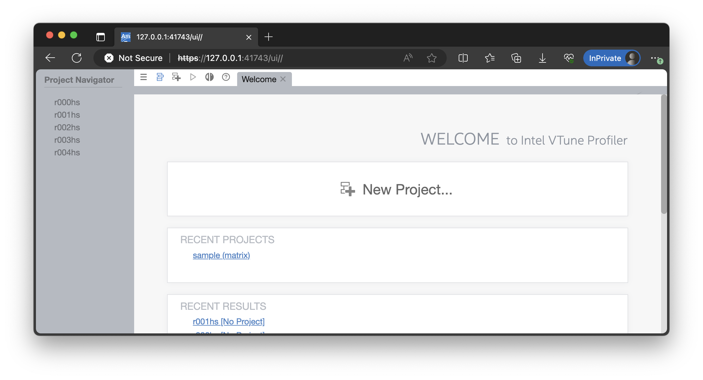

# Using Intel VTune, the modern x86 profiler

This page describes VTune setup relevant to our experiments. It contains pointers to various information. 

## Why VTune

For performance debugging like this, our "roll-it-your-own" manual code instrumentation can be too rudimentary. Modern profiler has been a crucial tool. In short, programmer launches a tool ("profiler") which in turns launches the target program being profiled. The profiler collects key information about target program execution. 

Over the past decade, profiling has seen tremendous improvement, evolving from software-based instrumentation to hardware-assisted sampling. Today, profilers can provide rich information at low overhead. 

**Availability:** Intel used to charge a few thousand $$ for a VTune license. Now it's freely downloadable. 

> Aside: Arm's profiler is called DS-5. 

## Naming

**VTune** is Intel's profiler. Prior to 2018 it was called Intel "VTune Amplifier" (a marketing term). There are still some old documents online with the latter name. Many of the current VTune executables are still named with the "amplxe-" prefix. Today it is called "oneAPI VTune". Intel likes to tinker with marketing terms.

## Useful VTune documents

VTune's [front page](https://software.intel.com/content/www/us/en/develop/tools/vtune-profiler/get-started.html) feature short articles & videos. Recommended readings: 

* A quick introduction. This [video](https://software.intel.com/content/www/us/en/develop/videos/introduction-to-intel-vtune-amplifier.html) (7 min)
* A case study on profiling Linux program. This [video](https://software.intel.com/content/www/us/en/develop/videos/finding-application-hotspots-on-a-linux-system-with-intel-vtune-amplifier-xe.html) (4.5min)
* About CPU instruction pipeline: this [video](https://techdecoded.intel.io/quickhits/what-you-need-to-know-about-the-instruction-pipeline/?elq_cid=3074796&erpm_id=5831526#gs.9eq2sk) and [this article](https://techdecoded.intel.io/resources/understanding-the-instruction-pipeline/?-1882156948.1541449095&erpm_id=3147218&elq_cid=3074796&erpm_id=5831526#gs.9ee57j) . A good refresher on CPU architecture and for understanding architecture profiling results. 

There are more and you may skim them.

The official user guide is [here](https://software.intel.com/content/www/us/en/develop/documentation/vtune-help/top.html). It's long and you do NOT have to read from back to end. Just make sure when you Google/Bing (e.g. "vtune threading profiling"), only pick results coming from this user guide. 

## Setup
In our experiments, we run and profile our program on the **target machine** and view profile results on the **viewer machine**.

**VTune version info**: 

| Profiler version               | Installation package               |
| ------------------------------ | ---------------------------------- |
| vtune_profiler_2020.2.0.610396 | vtune_profiler_2020_update2.tar.gz |


<!-- The newest VTune from [Intel](https://software.intel.com/content/www/us/en/develop/tools/vtune-profiler/choose-download.html#standalone).   -->

**Viewer**: Your own computer. Can be Windows/Linux/Mac. Technically, the VTune viewer is launched on the server as a backend process, and students see its GUI via a local browser.
**Target**: A multicore Linux machine, e.g. our course server. We will call VTune from command lines to collect trace. 

<!-- **You can profile on your local machine but we STRONGLY recommend most students to use the course server as a target. ** -->

VTune Path in our servers: `/opt/intel/vtune_profiler`

### Path setup (do this every time you login to the target)

```
source /opt/intel/vtune_profiler/vtune-vars.sh
export INTEL_LIBITTNOTIFY64=/opt/intel/vtune_profiler/lib64/runtime/libittnotify_collector.so
```

[Reference](# https://software.intel.com/content/www/us/en/develop/documentation/vtune-help/top/api-support/instrumentation-and-tracing-technology-apis/basic-usage-and-configuration/configuring-your-build-system.html#configuring-your-build-system) 

To automate, consider appending the above to your `~/.bashrc` on the target. 

### Workflow
<!--  -->
**Develop on the server, view results locally**: develop code on the server (via SSH terminals, VS code, mounted network filesystem, etc.). In this case, target & dev machines are the same. 
* Write code -> build binary -> (test to make sure it works correctly) -> profile the program with VTune the server 
* Run the VTune viewer on the server. Before you do this, make sure you do the **Path setup** above.
  ```
  # Use a random port (recommended)
  vtune-backend --data-directory <your directory> 

  # Use your port
  vtune-backend --web-port 23444 --data-directory <your directory>
  ```
  For **\<your directory\>**, you need to put the parent location where your results are located. For instance, if your results are located in `/u/bfr4xr/p2-concurrency/exp2/r000hs`,
  then **\<your directory\>** should be `--data-directory /u/bfr4xr/p2-concurrency/exp2`.
  
* Connect to the server via SSH with the designated port 
  If you successfully run the VTune viewer, you will see similar lines like below:
  
  In this case, a port number is `38881`, so all you need to do is to make another SSH connection with that port to use this VTune on your browser. This can be done as follows:
  ```
  # In your terminal application
  ssh -L 38881:127.0.0.1:38881 bfr4xr@granger2.cs.virginia.edu
  ```
* *Note: You need two SSH connections with this task: one running **the VTune viewer** and another making a connection for **SSH tunneling***
* View the results on your local browser (e.g., Edge, Firefox, or Safari)
  If you access the VTune viewer for the first time, you will see a prompt to input a passphrase. Insert any passphrase as you want.
  
  <!-- To associate execution hotspots with source lines or assembly (see below for an example), the local VTune needs the program source code & binary (which must be build with symbols and debugging information). You will have to fetch them from the server to your local machine after *every* source modification & rebuild. Consider automating this process with your script (e.g. rsync) -->
  
  If you are successfully connected then you should see this screenshot:
  


## Trace collection
On the target machine (e.g. granger1/2): 

### Example commands, to execute for each collection

```
# hotspot analysis
vtune -collect hotspot -knob sampling-mode=hw ./myprogram

# threading analysis
vtune -collect threading -knob sampling-and-waits=hw ./myprogram

# microarchitecture analysis
vtune -collect uarch-exploration ./myprogram

# For instance ...
vtune -collect hotspot -knob sampling-mode=hw ./list-p --iterations=1M --threads=1 --parts=1
```

(I found ``-collect hotspot`` is the same as ``-collect hotspots``)

### Profiling results

Will be stored in a subdirectory named as, e.g. "r000tr/", "r014ue/", "r027hs/". 

The numbers are assigned by VTune in an ascending manner. The last two letters are the analysis type. tr-"threading", ue-"microarchitecture exploration", "hs"-hotspot. 

Fetch the whole subdirectory to the viewer machine. On the viewer, open the directory using the VTune installation. 

## ITT API for tracemarker instrumentation

<!---- TODO--->

To visualize how workers have grabbed parts to work on, we can lightly instrument our source with VTune's ITT API. The API allows us to programmatically add markers to the VTune timeline. 

This is used in [exp2](./exp2.md#attempt-3-eliminate-stragglers-list-pml) for visualizing stragglers. 

To learn the use of API by example, search for "USE_VTUNE" in the project source code provided to you.

## What to do now

Set up VTune with your local machine and test the whole workflow with a simple program. 

